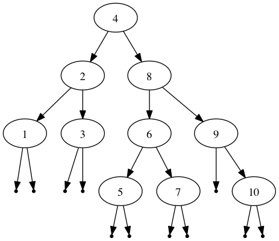
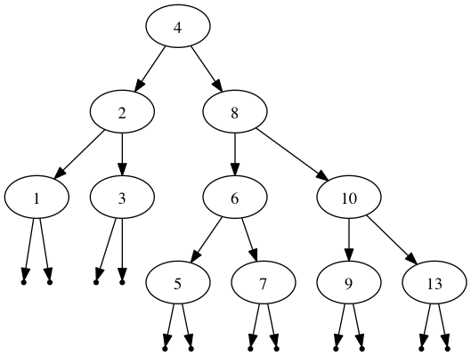
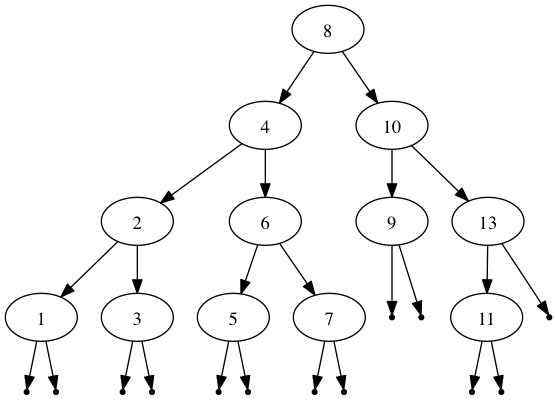
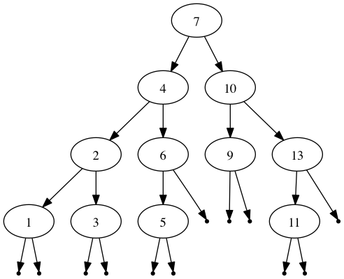

AVLTrees in Haskell
===================

Included is an implementation of AVL Trees in Haskell.

The Tester.hs file contains a program to view incremental changes in a tree using GraphViz.

A sample output of the Tester program `./Tester example.gv`
-----------------------------------------------------------
```
Open example.gv with GraphViz and use the following commands to interact with it:
d item	- deletes an item from the tree
i item	- inserts an item in the tree
f	- goes forward in the history
b	- goes back in the history
r a b	- creates a tree with elements in the range a...b (e.g. r 3 9)
q	- quits

>>=
```


```
>>= r 1 10
```


```
>>= i 13
```


```
>>= i 11
```


```
>>= d 8
```


```
>>= b
```


```
>>= f
```


```
>>= q
```
